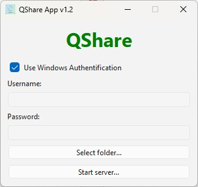
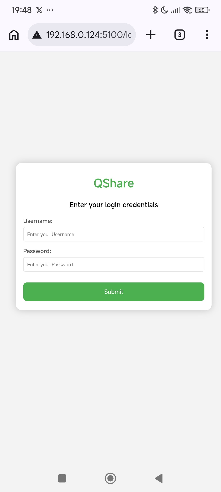
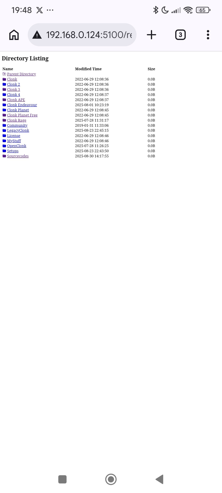
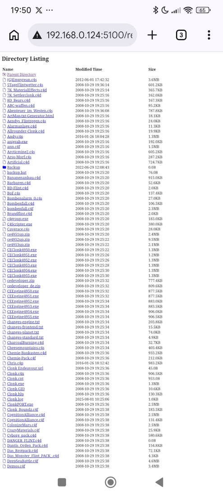

# QShare

A simple file sharing app for Windows 10/11 -> Mobile.

# Software Requirements

Download an install Python:

[]()https://www.python.org/downloads/

# Module Requirements

```console
pip install pyqrcode
pip install pypng
pip install flask
pip install cryptography
pip install pyinstaller
```

# Dependencies

```console
pip install pipdeptree
pipdeptree
```

```console
Flask==3.1.3
├── blinker [required: >=1.9.0, installed: 1.9.0]
├── click [required: >=8.1.3, installed: 8.3.2]
│   └── colorama [required: Any, installed: 0.4.6]
├── itsdangerous [required: >=2.2.0, installed: 2.2.0]
├── Jinja2 [required: >=3.1.2, installed: 3.1.6]
│   └── MarkupSafe [required: >=2.0, installed: 3.0.3]
├── MarkupSafe [required: >=2.1.1, installed: 3.0.3]
└── Werkzeug [required: >=3.1.0, installed: 3.1.8]
    └── MarkupSafe [required: >=2.1.1, installed: 3.0.3]
pip==26.0.1
pipdeptree==2.34.0
└── packaging [required: >=26, installed: 26.0]
pyinstaller==6.19.0
├── altgraph [required: Any, installed: 0.17.5]
├── packaging [required: >=22.0, installed: 26.0]
├── pefile [required: >=2022.5.30, installed: 2024.8.26]
├── pyinstaller-hooks-contrib [required: >=2026.0, installed: 2026.4]
│   ├── setuptools [required: >=42.0.0, installed: 82.0.0]
│   └── packaging [required: >=22.0, installed: 26.0]
├── pywin32-ctypes [required: >=0.2.1, installed: 0.2.3]
└── setuptools [required: >=42.0.0, installed: 82.0.0]
pypng==0.20220715.0
PyQRCode==1.2.1
PySide6==6.11.0
├── shiboken6 [required: ==6.11.0, installed: 6.11.0]
├── PySide6_Essentials [required: ==6.11.0, installed: 6.11.0]
│   └── shiboken6 [required: ==6.11.0, installed: 6.11.0]
└── PySide6_Addons [required: ==6.11.0, installed: 6.11.0]
    ├── shiboken6 [required: ==6.11.0, installed: 6.11.0]
    └── PySide6_Essentials [required: ==6.11.0, installed: 6.11.0]
        └── shiboken6 [required: ==6.11.0, installed: 6.11.0]
pywin32==311
qtwidgets==1.1
└── Markdown [required: Any, installed: 3.10.2]
```

# Build App

All bundled in one EXE (~ 51 MB):

```console
pyinstaller QShare.spec
```

EXE (~ 5 MB) + Directory (~ 116 MB):

```console
pyinstaller main.py --onedir --add-data "static;static" --add-data "templates;templates"
```

# Screenshots

Start QShare on Windows. Select folder to share.



Scan QR Code with your smartphone.


Login with your Windows User.



Directory listing of C:\Clonk



Files of a subfolder.



Show file for e.g. an image.

